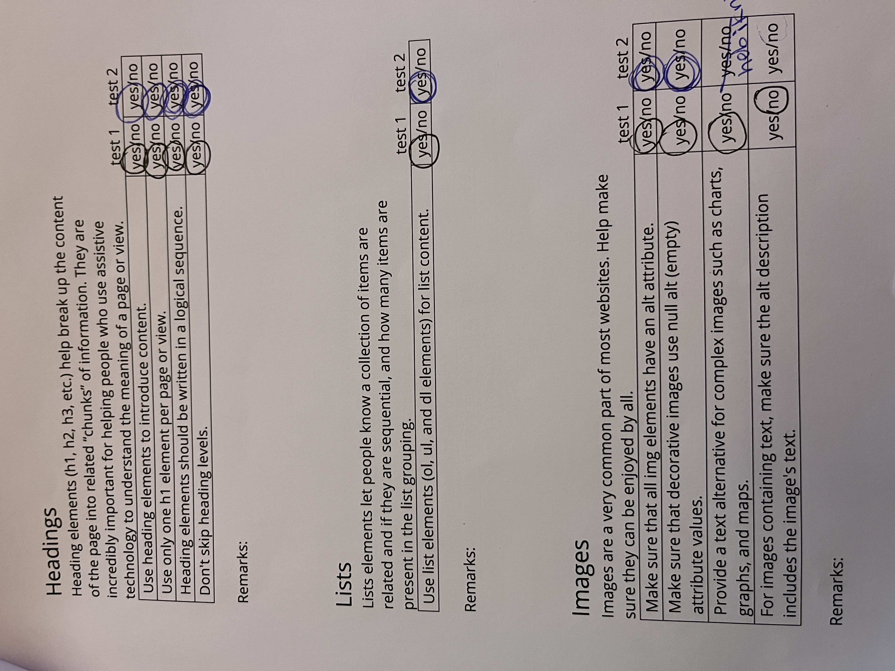
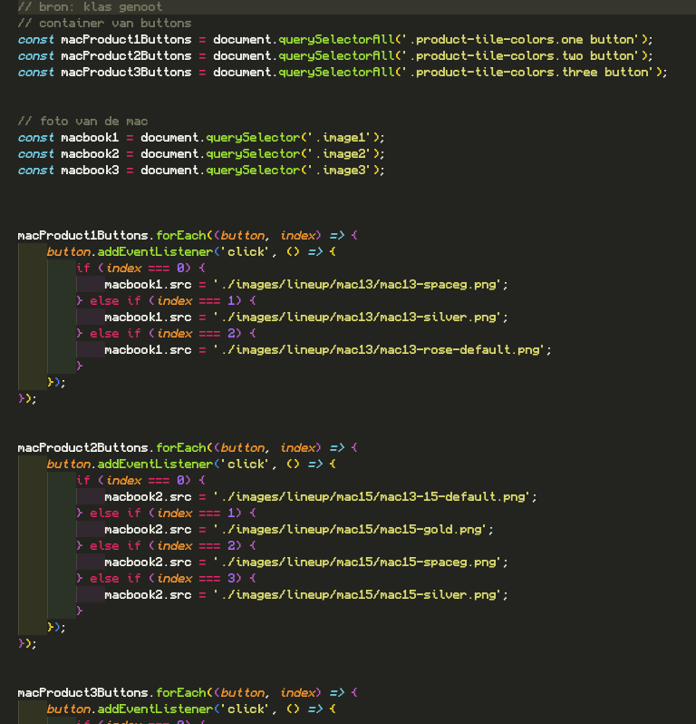

# Procesverslag
Markdown is een simpele manier om HTML te schrijven.  
Markdown cheat cheet: [Hulp bij het schrijven van Markdown](https://github.com/adam-p/markdown-here/wiki/Markdown-Cheatsheet).

Nb. De standaardstructuur en de spartaanse opmaak van de README.md zijn helemaal prima. Het gaat om de inhoud van je procesverslag. Besteedt de tijd voor pracht en praal aan je website.

Nb. Door *open* toe te voegen aan een *details* element kun je deze standaard open zetten. Fijn om dat steeds voor de relevante stuk(ken) te doen.

## Jij

  
uitwerken voor kick-off werkgroep

  ### Auteur:
 Fei Kielema

  #### Je startniveau:
  hier je startniveau (kies uit zwart, rood óf blauw)
Mijn start niveau is blauw, maar ik zou graag willen om rood te proberen. Ik zou mezelf graag meer willen uitdagen, alhoewel ik niet goed ben in coderen en ik het vaak frustrerend vind. 

  #### Je focus:
  hier je focus (kies uit responsive óf surface plane)
Mij lijkt het leuk om zelf nog dingen toe te voegen aan de website. Het maken van een dark mode functie lijkt me leuk. Dat de gebruiker op verschillende kleuren macbooks kan klikken dan dan ook daadwerkelijk de plaatjes ziet veranderen. Een leuke kerst thema erbij toevoegen, zoals sneeuw, een bewegende kerstman en een kerstboom. Die allemaal tevoren komen doormiddel op een knop te drukken.  

- kerstboom interactie
- kerstman laten animeren op het scherm
- darkmode
- met knoppen het plaatje en de kleur van een macbook veranderen 
- sneeuw over het scherm laten vallen

## Je website

  
uitwerken voor kick-off werkgroep

  ### Je opdracht:
  [I'm an inline-style link](https://www.apple.com)

  #### Screenshot(s) van de eerste pagina (small screen): 
Apple Home page 

 
  
   
    
     
     

  #### Screenshot(s) van de tweede pagina (small screen):
Mac detail pagina
  
  
  
  

## Toegankelijkheidstest 1/2 (week 1)

  
uitwerken na test in 2e werkgroep

Het is belangrijk dat een applicatie toegankelijk is voor verschillende gebruikers. Daarom gingen we tijdens de les experimenteren met VoiceOver, om een idee te krijgen hoe het is voor gebruikers die dit dagelijks moeten gebruiken. 

  ### Bevindingen
  Lijst met je bevindingen die tijdens het testen van de Voice Over naar voren kwamen:
- benoemt duidelijk aan wat er allemaal op de website staat en gaat van boven naar beneden van links naar rechts.
- Het leest de alt tekst van de plaatjes op. 
Leest letterlijk <emphasis>alles</emphasis> voor. 
- Begint vanaf bovenaan, wat in sommige gevallen vervelend kan zijn als iemand snel door een pagina wilt scrollen. 
- zegt als iets een button
- verteld hoeveel items er in een lijst zitten

## Breakdownschets (week 1)

  
uitwerken na afloop 3e werkgroep

  ### de hele pagina: 
  

  ### dynamisch deel (bijv menu): 
  

  ### wellicht nog een dynamisch deel (bijv filter): 
  

## Voortgang 1 (week 2)

  
uitwerken voor 1e voortgang

  ### Stand van zaken
  hier dit ging goed & dit was lastig (neem ook screenshots op van delen van je website en code)

 
Direct met het beginnen met het CSS bestand deed ze al niet wat ik wilde. Ik probeerde alleen de eerste header een rode achtergrond te geven om voor mezelf duidelijk te maken dat het werkte. In mijn HTML bestand heb ik meerdere headers, omdat ik dit zag bij de orginele website (misschien slim om dit later toch te veranderen naar 1 header, als ik erachter kom dat dit niet mag van de docent). Na meerdere pogingen is het me niet gelukt om dit te kunnen veranderen, dus heb ik het voor nu hierbij gelaten. 

 
Ik ben doorgegaan naar het maken van een gallerij foto's die naast elkaar staan. Dit ging echter wel beter en daar ben ik blij om. Ik probeerde het zo eccuraat mogelijk na te maken, maar dat is nog best lastig. 

Ik heb gekozen voor de Apple website, omdat ik mezelf graag wilde uitdagen. Helaas ben ik er achter gekomen dat het een stuk stroever gaat dan ik gehoopt had. Wens me succes.

  ### Agenda voor meeting
  samen met je groepje opstellen

  | student 1      | student 2          | student 3    | student 4        |
  | ---            | ---                | ---          | ---              |
  | dit bespreken  | en dit             | en ik dit    | en dan ik dat    |
  | en dat ook nog | dit als er tijd is | nog een punt | dit wil ik zeker |
  | ...            | ...                | ...          | ...              |

  ### Verslag van meeting
  hier na afloop snel de uitkomsten van de meeting vastleggen

  - Meer letten op de chronologische volgordes van de headers. 
  - Minder divs proberen te gebruiken.
  - Minder classes proberen te gebruiken.

## Voortgang 2 (week 3)

  
uitwerken voor 2e voortgang

  ### Stand van zaken
  hier dit ging goed & dit was lastig (neem ook screenshots op van delen van je website en code)

Het maken van de nav bar en het collage gedeelde ging goed. Ik ben blij met het eind resultaat. Ik ben blij dat het ook werk. Aan de nav bar moet ik nog veel doen, maar ik ben blij dat ik de basis af heb. 

Het gedeelte met de gegevevens van de computers ben ik nog steeds mee bezig. Ik vind het lastig om het helemaal mooi te krijgen. 

Overal vind ik dat het redelijk gaat. Ik moet nadat ik de 1e pagina af heb nog beginnen aan de tweede pagina. Ik hoop een klein beetje achter, maar hopelijk lukt het me om optijd alles af te hebben. 

  ### Agenda voor meeting
  samen met je groepje opstellen

  | student 1      | student 2          | student 3    | student 4        |
  | ---            | ---                | ---          | ---              |
  | dit bespreken  | en dit             | en ik dit    | en dan ik dat    |
  | en dat ook nog | dit als er tijd is | nog een punt | dit wil ik zeker |
  | ...            | ...                | ...          | ...              |

  ### Verslag van meeting
  hier na afloop snel de uitkomsten van de meeting vastleggen

  - Het zag er in het algemeen goed uit
  - letten op de hoeveelheid classes die worden gerbuikt
  - de namen van de classes logisch verzinnen
  - vaart maken met de interacties en de tweede pagina

## Toegankelijkheidstest 2/2 (week 4)

  
uitwerken na test in 9e werkgroep

  ### Bevindingen
  Lijst met je bevindingen die in de test naar voren kwamen (geef ook aan wat er verbeterd is):

  
  
  
  
  

  - de geruiker kan nu zelf bepalen wanneer die de persoon start en pauseert en krijgt er dus meer controle over.
  - mijn website heeft nu ook een dark mode, wat voor een betere kleur contrast zorgt en het toegankelijker voor andere maakt. 

## Voortgang 3 (week 4)

  
uitwerken voor 3e voortgang

  ### Stand van zaken
  hier dit ging goed & dit was lastig (neem ook screenshots op van delen van je website en code)
  
  
Ik wilde graag dat als de gebruiker op een kleur bol klikte dat het plaatje van de mac dan ook zou veranderen. In eerste instantie lukte dit niet en had ik het op andere manieren geprobeerd in javascript. 
Uiteindelijk heeft een klasgenoot mij geholpen om dit te fixen. 

  
Hetzelfde geldt met de santa animatie. Ik probeerde op verschillende manieren om dit te laten bewegen als de gebruiker op een knop drukte. Na heel veel prutsen en uitproberen is het me uiteindelijk toch gelukt. 

  ### Agenda voor meeting
  samen met je groepje opstellen

  | student 1      | student 2          | student 3    | student 4        |
  | ---            | ---                | ---          | ---              |
  | dit bespreken  | en dit             | en ik dit    | en dan ik dat    |
  | en dat ook nog | dit als er tijd is | nog een punt | dit wil ik zeker |
  | ...            | ...                | ...          | ...              |

  ### Verslag van meeting
  hier na afloop snel de uitkomsten van de meeting vastleggen
- Het ziet er over het algemeen goed uit. Probeer nog iets meer op de details van de opmaak te letten. 
- probeer goede namen te verzinnen voor je elementen. 

  - een lijstje maken met de dingen die ik nog moet doen
  
- letten op de opmaak van de site
- nog werken aan dde interacties

## Eindgesprek (week 5)

  
uitwerken voor eindgesprek

  ### Je uitkomst - karakteristiek screenshots:

  
  
  
  
  
  
  
  
  
  
  
  
  
  
  
  
  
  
  
  
  
  
  

  ### Dit ging goed/Heb ik geleerd: 
  Korte omschrijving met plaatjes

  
  
  
  
  
  
  

Over het algemeen ging het wel goed. Na veel frustratie is het me toch gelukt om een redelijk product te kunnen laten zien. Ik ben uiteindelijk toch wel blij met wat ik nu bereikt heb. 
- Ik ben zeer blij dat mijn buttons en kleine animaties het allemaal doen. Met veel tijd en met veel frustratie is het uiteindelijk toch gelukt. Het javascript was voor mij zeker wel de grootste obstakel.
- Met de opmaak ben ik vooral wel blij. Bij de voorbeelden kan je zien dat ze nog best wel goed gelukt zijn en redelijk lijken op het orgineel. 
- Met plaatjes positioneren was het soms ook nog even worstelen, maar dat is gelukkig ook gelukt. 

  ### Dit was lastig/Is niet gelukt:
  Korte omschrijving met plaatjes
  
  
  
  
  

Hoewel het bij de opmaak wel prima ging, had ik toch nog graag gewilt dat ik meer interacties er in kon verwerken, zodat die de website meer tot leven konden brengen. 
- Vooral zorgen dat de buttons het daadwerkelijk ook deden was erg lastig en is me ook gewoon niet gelukt. Ik zou dat nog wel graag willen leren. 
- Ook bij sommige elementen zoals een custom start/pauze knop maken is me ook helaas niet gelukt. 
- Naast dat het meeste vormgeven wel lukte, had ik hier ook wel vaak moeite mee. Dit is de zien bij het maken van een rechte lijn onder een tekst onderdeel. 
- Het gebruiken van javascript was zeker erg hinderend voor mij, omdat ik daar meer moeite mee heb. Het duurde mij daarom ook lang om de interacties met de buttons aan de praat te krijgen. 

## Bronnenlijst

  
continu bijhouden terwijl je werkt

  Nb. Wees specifiek ('css-tricks' als bron is bijv. niet specifiek genoeg). 
  Nb. ChatGpT en andere AI horen er ook bij.
  Nb. Vermeld de bronnen ook in je code.

  1. https://codepen.io/Fkielema/pen/PoVLMNm 
  2. https://codepen.io/shooft/pen/KKbwmao
  3. Klasgenoot
  4. https://www.sinds1971.nl/spelenmetcss/vetgans/
  5. https://codepen.io/jemware/pen/kPoYbe
  6. https://webdesign.tutsplus.com/how-to-create-a-frosted-glass-effect-in-css--cms-32535t
  7. https://devdevout.com/css/css-inner-shadow
  8. https://www.freecodecamp.org/news/how-to-center-an-absolute-positioned-element/
  9. Chat Ai

